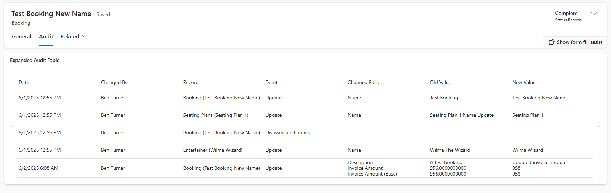

# Expanded Audit Control



## Adding to a Form

The control needs two fields:

- Entity logical name
- Entity id

I could not find a way to pass these as bound parameters and controls would only
appear as an option in model-driven forms where there is at least one bound
parameter so the control also requests a primary name column:


## Approach

There were two main challenges:

- Efficiently mapping field logical names to display names
- Passing relationships and related entities to the control

Both challenges were solved by writing a SchemaBuilder console program. This has
been linked to an npm script:

```terminal
npm run buildSchema
```

The program:

- Gets all custom relationships defined for one or more entities
- Creates a list of all entities in these relationships
- Fetches metadata for this wider list of entities
- Writes the results to a [typescript file](./ExpandedAuditingControl/model/cached_dataverse_metadata.ts)

This simplifies the code quite a bit and the data can be fetched with just two
calls. The first to get all related entities and the second to get audit data
for this list of entities.

Originally, I tried to pass a comma separated string of relationships, but this
felt a little unsafe and there was no reliable way to parse the related entities
from a relationship string.

### A Better Approach

The main problem with this approach is that the user needs to download all of
this metadata. The file is relatively small and will be cached, however, it may
be better to shift this logic to a custom web api:

- Metadata for for relationships and entities can be cached server-side
- Audit data rows can be returned preformatted to the client

This approach would also simplify updating the cached metadata.

## SchemaBuilder

The schema builder requires a .env file in the SchemaBuilder directory:

```env
CLIENT_ID={APPLICATION ID}
CLIENT_SECRET={APPLICATION SECRET}
INSTANCE_URL=https://{{ORG}}.crm11.dynamics.com
```

The app registration will also need to registered as an app user in the relevant
environment and given the required permissions.

This has been hacked together, it would be better if it:

- accepted a path to a configuration.json file
- accepted a path to an output file

This seemed like overkill for a proof of concept.

## Missing Features

There are a few missing features which have not been implemented but are
relatively straight forward:

- Audit records are not being ordered (I forgot: quick fix)
- There is no pagination (I didn't have time: simple but time consuming fix)
